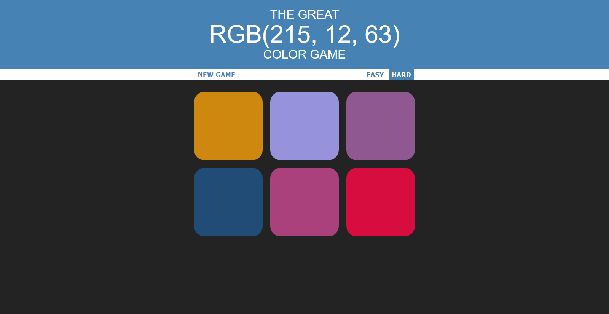
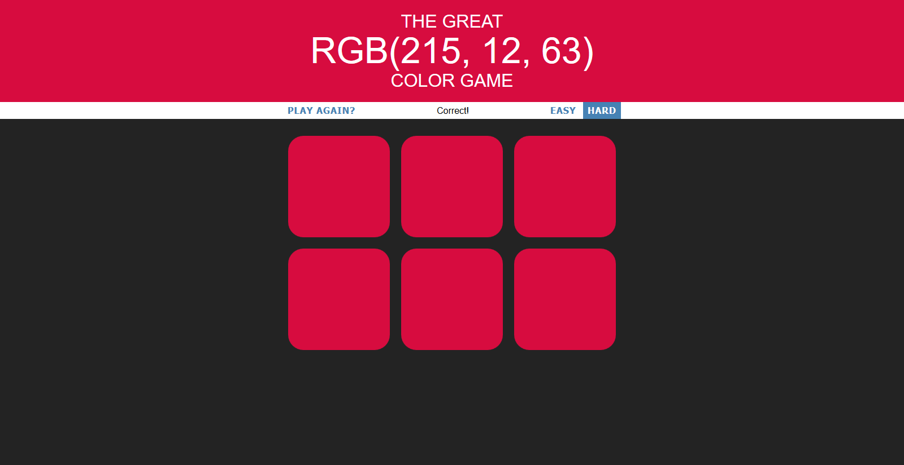

# colour-guess: a fun JavaScript game

RGB colour guessing game. Pick the colour you think corresponds to the generated RGB code.

## Screenshot

# License
Copyright (C) 2018 John Guyan

Created as part of the Udemy online course "The Web Developer Bootcamp", by Colt Steele